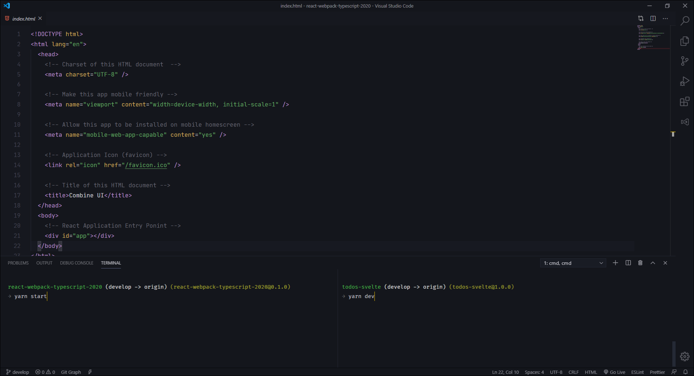
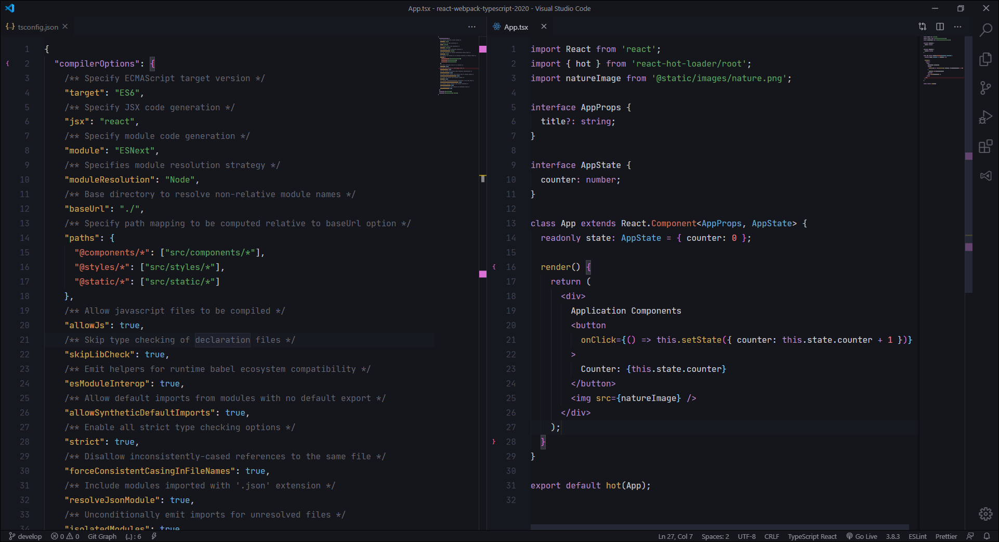

# Codesbiome Theme

Dark Theme for Visual Studio Code with custom colors for Editor & UI Elements.
Theme is also suitable for working at Dim-Light Environments.


### Supported Languages

- CSS
- SASS
- LESS
- HTML
- JavaScript
- React + JSX
- Markdown
- TypeScript + TSX
- JSON
- YAML
- XML
- PHP
- C#
- C++
- Svelte
- Dart
- GDScript

<br>

### Information & Tips

If you're using Windows 10, these settings of `Visual Studio Code` might provide you a better experience :

```json
  "editor.fontSize": 15,
  "editor.lineHeight": 26,
  "editor.suggestFontSize": 13,
  "editor.padding.top": 10,
  "terminal.integrated.lineHeight": 1.4
```

- Text font used in screenshot files is `Jetbrains Mono`
- File icons theme used in screenshot is `Material Icon Theme`
- Terminal shell used in screenshot is `Cmder`

<br>

### Issue or Requests

Found anything invalid or have a request related to this project?
Feel free to create New Issue at respository <a href="https://github.com/codesbiome/vscode-codesbiome-theme/issues">here</a>. Thank you!

<br>

---

### Other Screenshots

Terminals (Split) View with <a href="https://cmder.net/">Cmder</a> Terminal integration for VS Code. You can use any terminal tool you like :



Split Tabs View :


