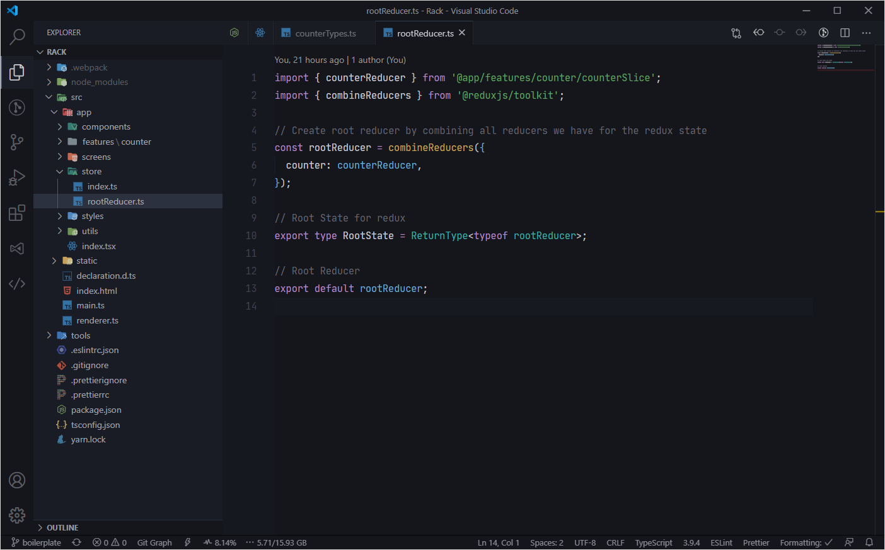
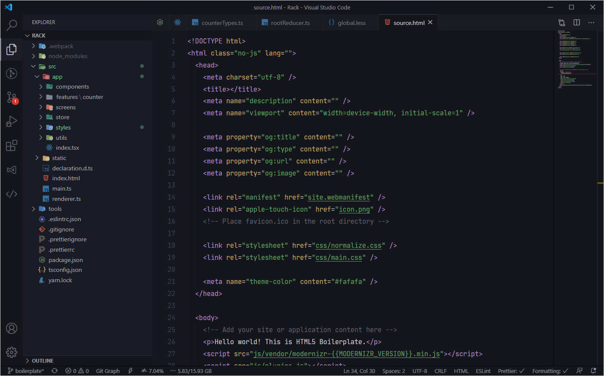
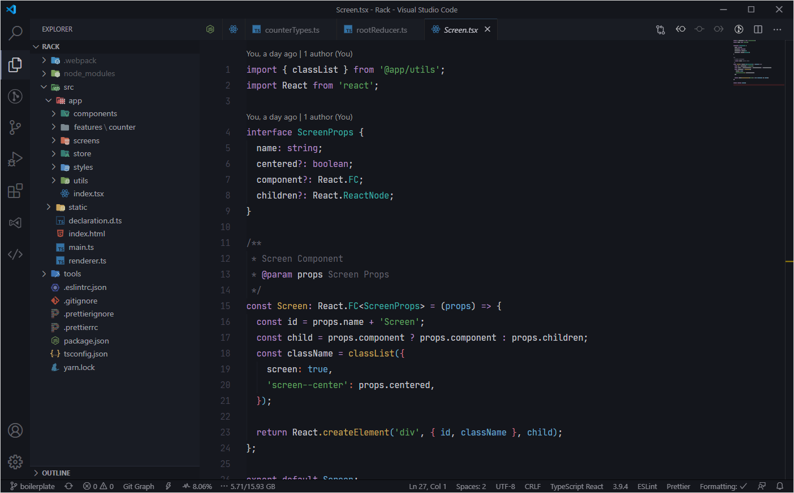
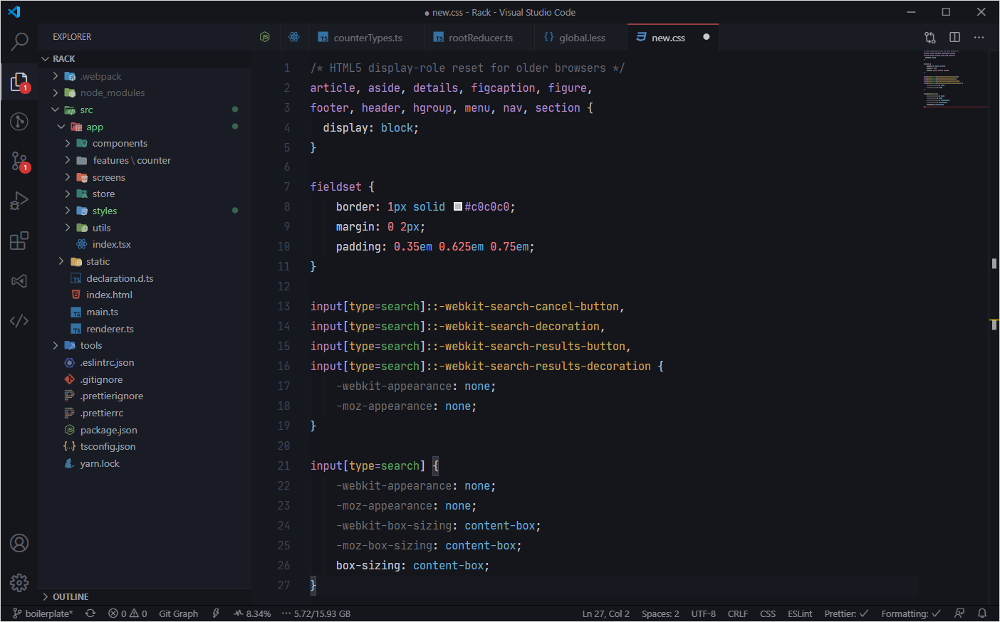
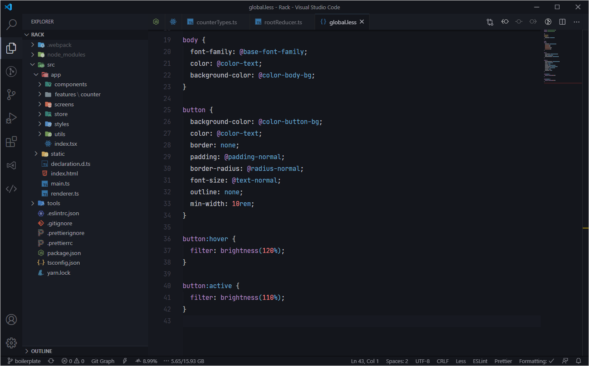

# Codesbiome Theme

> Custom Dark Theme for `Visual Studio Code` with clear colors for Code Syntax & UI Elements. Provides easy to ready environment when working at Night (Dim Light).



<br />
<br />

<details>
  <summary>Screenshot : <code>HTML</code></summary>
  <br />
  
</details>

<details>
  <summary>Screenshot : <code>JSX/TSX</code></summary>
  <br />
  
</details>

<details>
  <summary>Screenshot : <code>CSS</code></summary>
  <br />
  
</details>

<details>
  <summary>Screenshot : <code>LESS</code></summary>
  <br />
  
</details>

<br />

### Supported Languages

- `JavaScript`
- `TypeScript`
- `HTML`
- `CSS`
- `LESS`
- `SASS (SCSS)`
- `JSX (React)`
- `XML (XAML/YAML)`
- `Markdown`
- `JSON`
- `YAML`
- `PHP`
- `C#`
- `C++`
- `Svelte`
- `Dart`
- `GDScript`

<br>

### Information & Tips

If you're using Windows 10, these settings of `Visual Studio Code` might provide you a better experience :

```json
  "editor.fontSize": 15,
  "editor.lineHeight": 26,
  "editor.suggestFontSize": 13,
  "editor.padding.top": 10,
  "terminal.integrated.lineHeight": 1.4
```

- Text font used in screenshot files is `Jetbrains Mono`
- File icons theme used in screenshot is `Material Icon Theme`
- Terminal shell used in screenshot is `Cmder`

<br>

### Issue or Requests

Found anything invalid or have a request related to this project?
Feel free to create New Issue at respository <a href="https://github.com/codesbiome/vscode-codesbiome-theme/issues">here</a>. Thank you!

<br>
