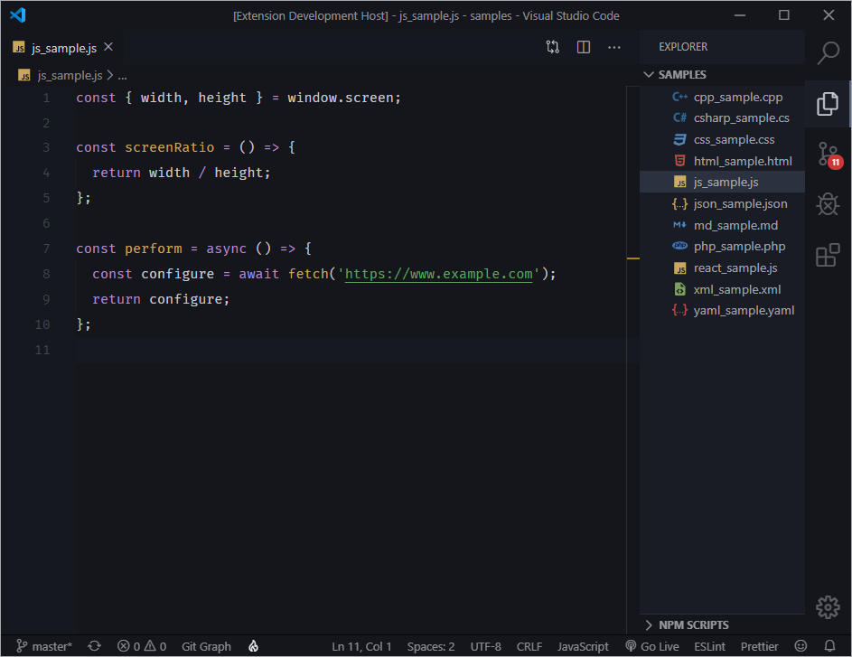
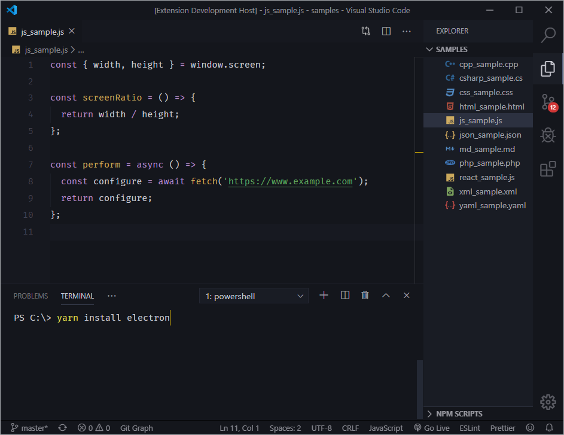
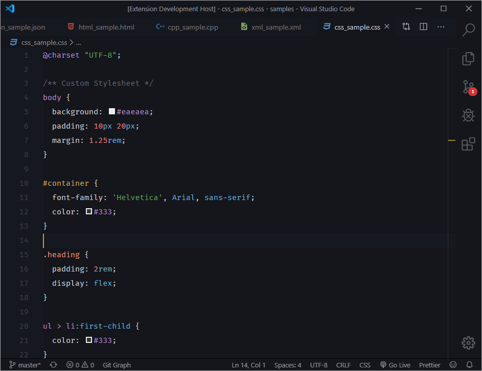
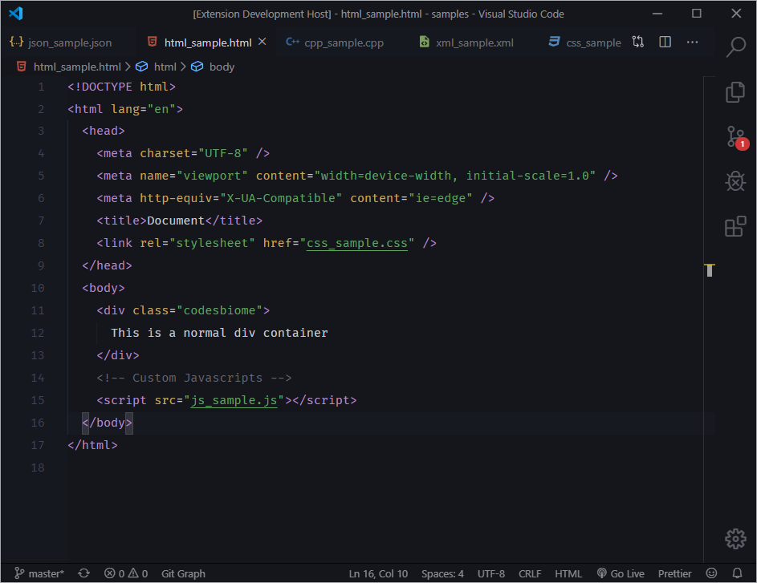
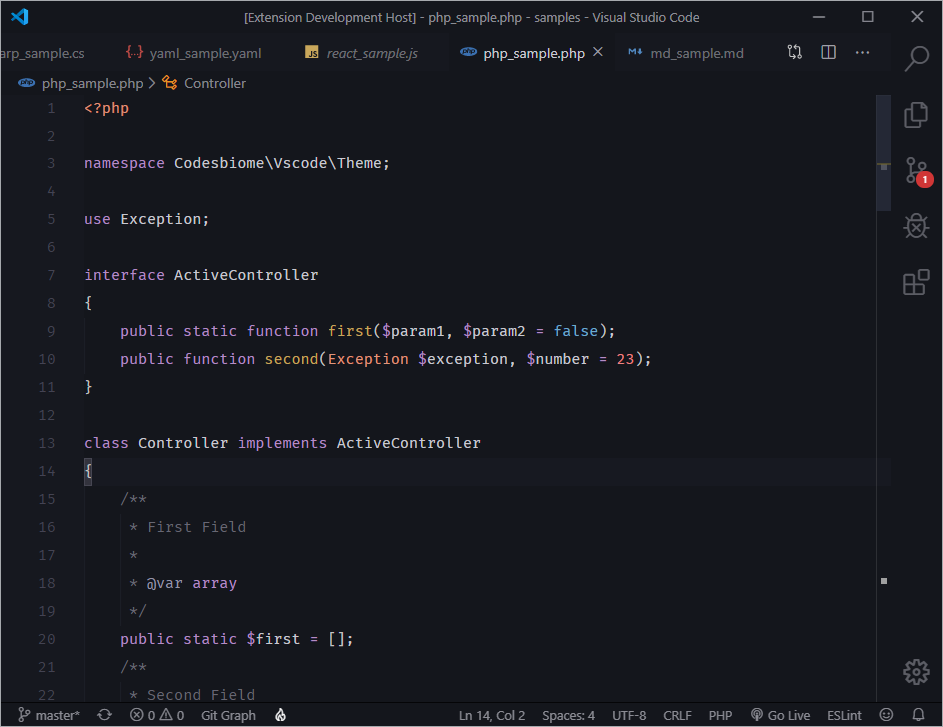
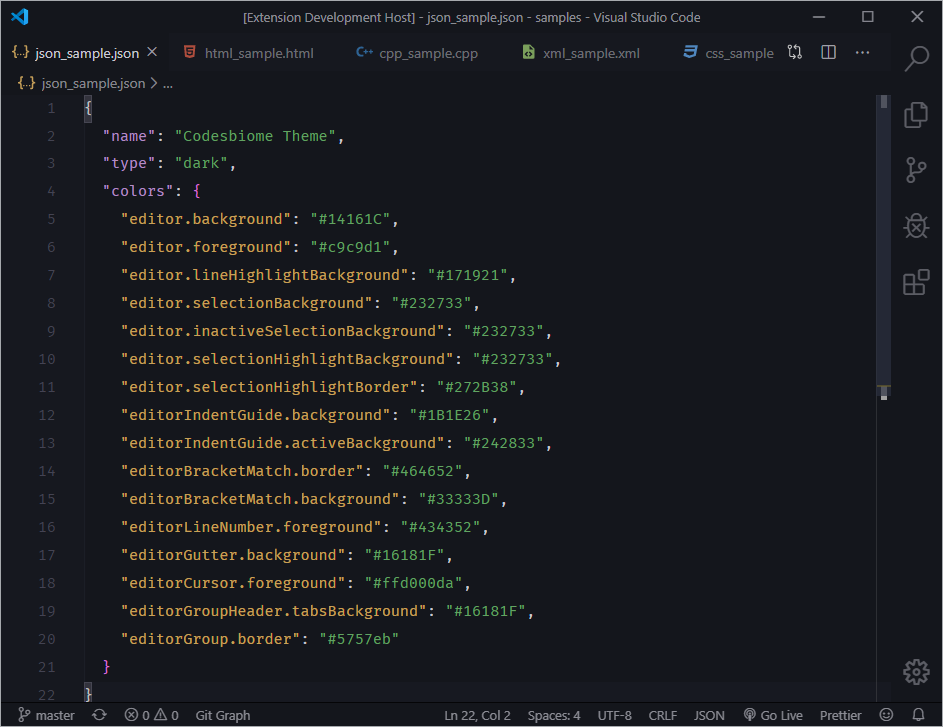

# Codesbiome Theme

A dark theme for Visual Studio Code editor with custom colors for Editor and UI Elements.

## Screenshots

### Javascript



With Terminal



### CSS



### HTML



### PHP



### JSON



### CSharp


<br />

## Tips

If you're using Windows 10, these global settings might provide you a better experience.

```json
{
  "editor.fontSize": 14,
  "editor.lineHeight": 26,
  "editor.fontFamily": "'Fira Code', Consolas, 'Courier New', monospace",
  "editor.suggestFontSize": 13,
  "terminal.integrated.fontFamily": "Fira Code",
  "terminal.integrated.lineHeight": 1.4,
  "workbench.iconTheme": "material-icon-theme",
  "material-icon-theme.activeIconPack": "vue_vuex",
  "material-icon-theme.opacity": 0.8,
  "breadcrumbs.filePath": "last"
}
```

<br />

## Issue or Request

Found anything invalid or have a request related to this project?
Feel free to create New Issue at respository <a href="https://github.com/codesbiome/vscode-codesbiome-theme/issues">here</a>. Thank you!
